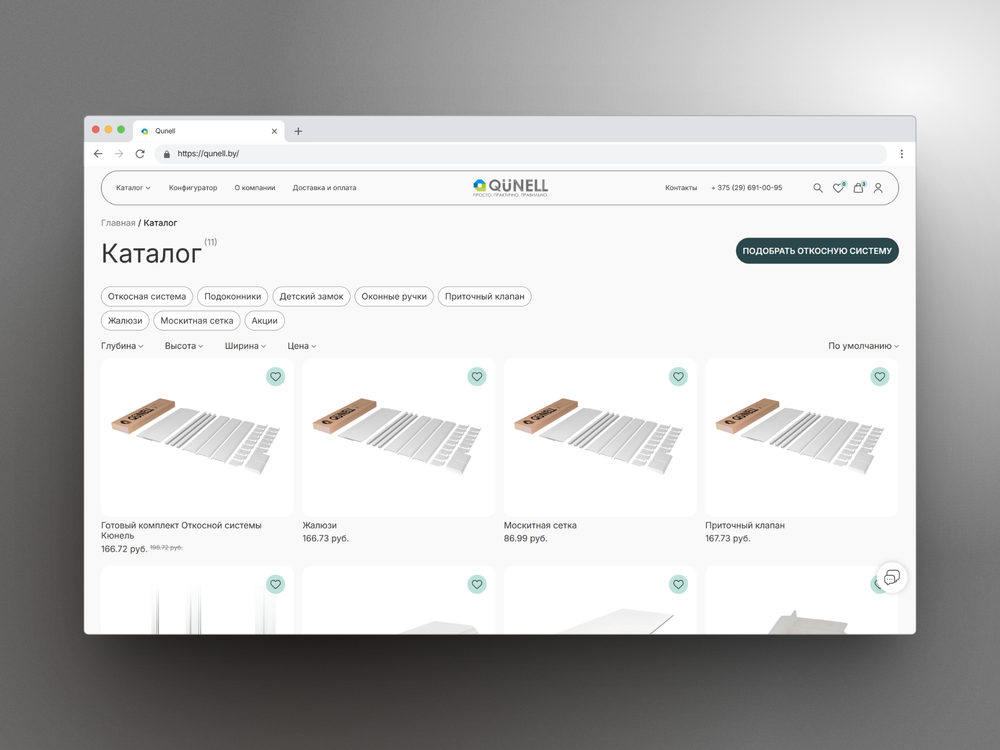
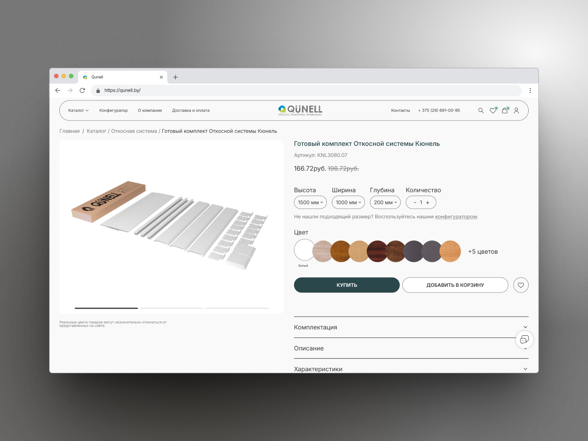

# QUNELL Corporate Website

Website for the QUNELL brand — a manufacturer of window slope systems and construction finishing solutions.

## Overview

QUNELL is a manufacturing company specializing in window slope systems, trims, profiles, and related finishing products for the construction industry. The website serves as a corporate platform for presenting products, technical documentation, and partner information. :contentReference[oaicite:0]{index=0}

## My Contribution

### Frontend Development
- Responsive interface implementation
- Mobile adaptation
- Interactive UI components
- Performance optimization

### Backend Development
- CMS integration
- Form processing
- Content management functionality
- API integrations

### SEO & Performance
- Technical SEO optimization
- Structured metadata
- Page speed improvements
- Search engine indexing setup

## Technologies

- HTML5
- CSS3 / SCSS
- JavaScript
- PHP
- MySQL
- Git

## Key Features

- Product catalog
- Corporate information pages
- Contact forms
- Document management
- Responsive design
- SEO-friendly architecture

## Screenshots

### Home Page


### Product Catalog


### Product Details


## Architecture

```text
Client
   │
   ▼
Frontend
   │
   ▼
Backend / CMS
   │
   ▼
Database